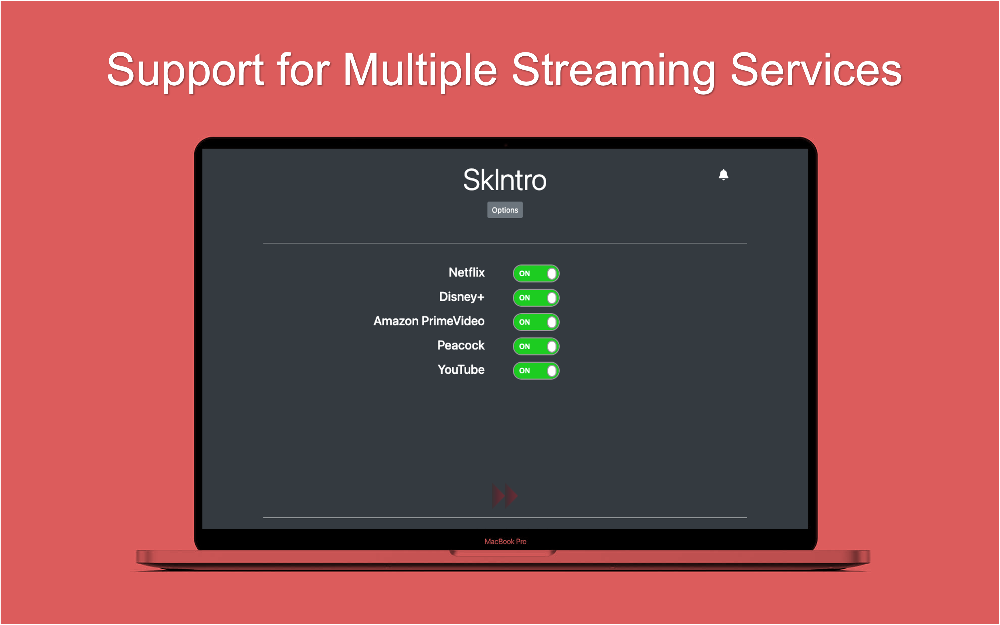

# SkIntro

Most streaming services offer a "Skip Intro" button. If you always press that button, this extension is for you. 

## Download
SkIntro is now available to download from the [Google Chrome Store](https://chrome.google.com/webstore/detail/skintro/acjikceibgbijbnhfialnjhilckdajan).

## Description
A lightweight Chrome extension to auto-skip Intro, Recap, and Ads on streaming services (and YouTube). 

Currently it supports the following services,

- [x] Netflix - Recap, Intro
- [x] Amazon Prime Video - Intro
- [x] Peacock TV - Intro
- [ ] Hulu
- [ ] HBOMax
- [x] Disney+ - Intro
- [x] YouTube - Ads

Support for other services is coming soon.

It works by waiting for the "Skip Intro" button to appear and clicks it, so it'll only work for services/shows that support displaying that button.

## ToDo
- [x] Add Switches for each services
- [ ] Add Custom Shows/Movies to Skip or not Skip
- [x] Package and upload to Chrome Store
- [x] Change icon
- [x] Add notification
- [x] Add notification option

## Libraries / Frameworks
- Bootstrap
- FontAwesome
- [arrive.js](https://github.com/uzairfarooq/arrive)